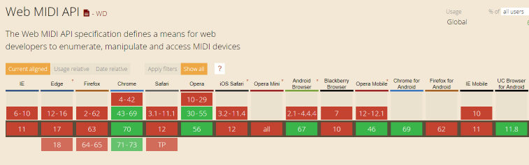
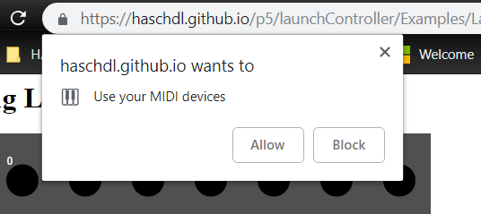
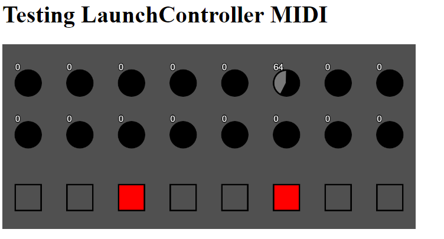

# launchControllerJs
Novation LaunchController wrapper for Javascript. Primarily targeted at p5.js

Please note that using MIDI in the browser has very limited support. 
I tested only with Chrome 70.

**This is still work in progress**

# Testing if it works...

1. Connect your Launch Control to your computer
2. Using a supported browser, navigate to xxx
3. If prompted, give permission to the web site to access MIDI devices

4. The sketch should reflect the status of knobs and pads in your sketch

See video in docs folder: LaunchControllerBrowser.mp4
