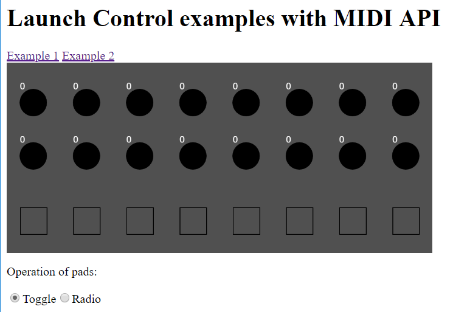
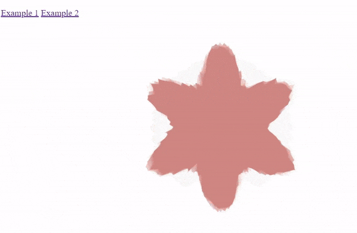

# launchControllerJs

A Javascript client for the Novation MIDI controllers
[LaunchPad Mini](!https://novationmusic.com/launch/launchpad-mini) and LaunchControl.

* [Examples](#examples)
* [Limitations](#limitations)

Please [submit an issue](https://github.com/haschdl/launchControllerJs/issues/new) in case of bugs or feature suggestions.

# Examples

You can the examples locally or use the live version at  https://haschdl.github.io/p5/launchController/Examples/LaunchController.html

1. Connect your Launch Control to your computer
2. Using a supported browser, navigate to  [demo page](https://haschdl.github.io/p5/launchController/Examples/LaunchController.html)

3. If prompted, give permission to the web site to access MIDI devices

4. Example 1: 
This example shows the current value of knobs and status of pads. The library provides two ways of working with pads. In *Toggle*, each pad can be individually activated; in *Radio*, only one pad can be activated at a time. Radio is useful if you want to use the pads as selector - in example 2 I use it the pads to a pick a color from a list.

See video in docs folder: LaunchControllerBrowser.mp4

5. Example 2:
This example shows how to use the library in a p5.js drawing. Use knobs 1 to 4 to control the shape, and pick 
a color by using one of the pads.

# Limitations
Please note that using MIDI in the browser has very limited support. See https://caniuse.com/#search=MIDI page for details. Tested only with Chrome 70.  
